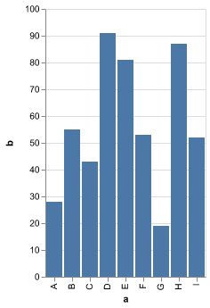

# altair-saver-resvg

pkg + resvg + vega + altair = static beauty


## Problem

`Vega` & `Vega-lite` offer rich interactive visualizations and `Altair` has brought them to python.
However, exporting static visualizations without an appropriate renderer is challenging.
Even in circumstances in which a renderer is present as in `jupyter`,
t still requires manual action by the user to click and save files.

`Altair` to it's credit has developed a workaround in `altair_saver` by primarily utilizing `selenium`.
Setting up `selenium` requires handling multiple additional pieces of software complicating deployment much farther beyond a simple `pip install`.
Unsurprisingly, running a headless browser to inject some javascript and pull out svg/img data is not without it's bugs.
Indeed it would seem the most recent version of selenium has broken this method all together [altair-viz/altair_saver#104](https://github.com/altair-viz/altair_saver/issues/104).

Aside from `selenium` there is also a method that relies on installation of `node` followed by the necessary `vega` libraries.
I find the results of this method far more stable, but it still requires additional *non-python* components to be manually setup by the user.

## Possible Solutions

### Scraping 2.0

Use new scraping libraries that don't require as much setup overhead. One option is using a saver based on [`pyppeteer`](https://github.com/pyppeteer/pyppeteer).
I've made a working version of the implementation on my own fork of `altair_saver`.
This adds an additional saver you can specify with `save(...,method="pyppeteer")`
You can test this yourself:

```
pip install git+https://github.com/daylinmorgan/altair_saver@pyppeteer pyppeteer
python -m pyppeteer install
```

Take note of the second step. This installs `pyppeteer`'s version of chrome. No need to install a separate browser specific webdriver.
This is easier to setup than a `selenium` + browser. But I ran into strange `async` bugs on windows.

I also managed to make a separate workable saver based on [`playwright`](https://playwright.dev/python/).

Both of these don't significantly improve on the problems of installing headless browser just to run some javascript that the user also still needs to manage manually in their deployment.

### `Kaleido`

`Kaleido` is `plotly`'s answer to this problem which skips the scraping and compiles the parts of the browser they need into their own custom executable.
As they acknowledge themselves, building said executable is a challenge.

They present `kaleido` with a plugin architecture but currently this requires one to write `c++`,`js`, and `python`, in order to add support for new libraries.
Though assuming you can make a working additional scope, it's [not clear](https://github.com/plotly/Kaleido/issues/135) the next steps after.
Additionally the departure of the main contributor from plotly makes it unclear what the future of `kaleido` looks like.


### Self-contained Python Wheel

Our ultimate goal should be a self-contained (platform-specific if necessary) python wheel, similar to `kaleido`, that users can install and produce `svg`,`png` and compiled `vega`.

This is a proof of concept "saver" that could be integrated into the upstream [`altair_saver`](https://github.com/altair-viz/altair_saver).

## How does it work?

We leverage `vercel/pkg` and distribute self-contained platform-specific executables within the python wheels.
This takes the problems of installing and setting up the needed backends from the user and leaves it to a well crafted CI.

First we need access to the libraries that render our visualizations `vega` & `vega-lite`.
We can use the `vega` API to generate a `view` and easily convert this to `svg`.

Generating appropriate png is a different problem. The `vega` view API can return an `svg` or `canvas` object.
In the browser this uses `HTML canvas`, server-side they rely on `node-canvas`.
This works fine in a properly configured `node` environment,
but `canvas` has a number of system dependencies and caveats that make packaging it with `vercel/pkg` a problem.

Instead, we can take advantage of a different `svg` rendering library [`RazrFalcon/resvg`](https://github.com/RazrFalcon/resvg/) and [`yisibl/resvg-js`](https://github.com/yisibl/resvg-js).

## Building the Wheel

For now the wheels will need to be built manually and the executable copied into the appropriate package directory. This would ultimately be handled at build time by `setuptools`.

### Building `vega-resvg`

To get started you'll need `npm` and `python`.

```bash
cd js
npm install
npm i -g vercel/pkg
```

In order to cross-compile the executable's you'll need to have available the necessary `resvg-js` node add-ons you can use `./js/get-binaries.sh` to fetch them all.
The necessary binary for your own architecture should be pickup by the initial `npm install`.

To build the executable run the following specifying your target, see `vercel/pkg` for info about supported targets.
Then copy this binary to `altair_saver_resvg/src/vega-resvg`.

```
pkg index.js --no-bytecode --public-packages "*" --public -C GZip --target linux -o vega-resvg
cp vega-resvg ../altair_saver_resvg/src/vega-resvg
```


Finally, build the wheel:

```
python -m build --wheel
```

You can then install this wheel and test it using the included examples:
```
pip install dist/*.whl
cd examples
python make-examples.py
```

## Results

<table>
  <tr>
    <th> svg </th>
    <th> png </th>
    <th> png (scale factor 2)</th>
    </tr>
    <tr>
    <td></td>
    <td></td>
    <td></td>
  </td>
  </tr>
</table>


## Possible Outstanding Issues

1.`Resvg` support for svg seems good but's it's possible it could be missing something to render specific charts/components.

2. M1, it should be possible to build for Apple silicon but the binaries will likely need to be signed to not panic.

3. Currently data is handled with "strinified" json to and from the packaged executable. This will likely be a problem with more complex charts or those with large data, particularly on windows where running the example script produces: `FileNotFoundError: [winError 206] The filename or extension is too long.`

This choice was mainly to align with the `Saver` API which expects to receive the data to write to a file in it's own save method.

However, instead we could instead pass the vega-lite spec to a temporary json file and pass this path as an argument to `vega-resvg`.

If we take this approach it also opens up the possibility to mirror the features of the native `vega` cli in a python accessible entrypoint such as:

```
python -m altair_saver.vega --input chart.vl.json --output chart.png
```
